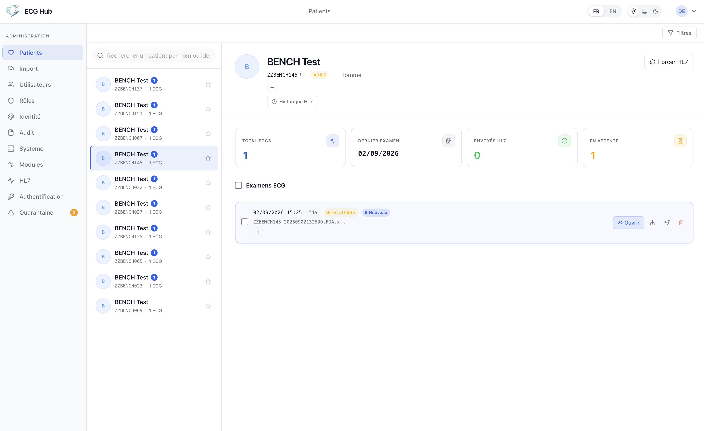

<h1 align="center">ECG Hub</h1>

<p align="center">
  <b>Vendor-neutral ECG ingestion and management for hospitals.</b>
</p>

<p align="center">
  <a href="#getting-started">Getting started</a> ·
  <a href="#features">Features</a> ·
  <a href="#how-it-works">How it works</a> ·
  <a href="docs/deploy-prod.md">Deployment</a> ·
  <a href="CONTRIBUTING.md">Contributing</a>
</p>

<p align="center">
  
  
  
  
</p>

<p align="center">
  
</p>

## Introduction

ECG Hub sits between bedside ECG devices (Philips, GE, Nihon Kohden, DICOM
modalities…) and the hospital IT system. Devices push their recordings over the
protocols they already speak — FTP, DICOM C-STORE, ECTP — and the hub parses
every vendor format into a common model, enriches it with patient identity from
the HIS over HL7, keeps the original files intact, and gives clinicians a web UI
to browse, view and export ECGs. A copy can be forwarded to an external PACS.

> **Non-diagnostic use.** ECG Hub is a data-management and visualisation tool.
> It is not a medical device and must not be used as the basis for diagnosis.

## Features

**Ingestion** — a built-in FTP/FTPS server, a DICOM C-STORE SCP and an ECTP
listener receive files with no agent on the device. A router matches each file
to a vendor module that validates and parses it; modules start and stop from the
admin UI without restarting the server.

**Vendor formats** — Philips, GE MUSE, Nihon Kohden, Mindray and DICOM waveform,
converted to a common model and exportable as PDF, HL7 aECG XML, DICOM or the
native format.

**Patient identity** — ECGs arriving without a usable patient ID enter an
`unidentified` workflow: an operator assigns them to a patient, guarded by name,
date-of-birth and ID cross-checks, and the file is re-ingested. An HL7 scheduler
queries the HIS to enrich pending ECGs, with retries and an exhausted state.

**Storage** — originals land on a dedicated volume with metadata in PostgreSQL,
and unparseable files go to a separate quarantine for review. S3-compatible
object storage is optional: the volume then acts as an upload spool, so a bucket
outage delays uploads instead of refusing ingestion.

**Distribution** — proxy connectors forward a copy of each ECG to external
systems (PACS over DICOM C-STORE, ECTP/FTP endpoints) with retries; webhooks
notify third parties after identification; batch export produces ZIPs.

**Waveform viewer** — a WebGL 12-lead viewer with the usual calibration,
gain and sweep-speed controls, driven from the decoded samples.

**Security** — local, OIDC and LDAP authentication, role-based permissions, API
keys and a full audit trail. Provider and module credentials are stored
AES-256-GCM-encrypted. FTPS and DICOM TLS use certificates mounted from the
host, so renewal stays with whoever already does it.

**Observability** — around 40 Prometheus metrics covering ingestion, modules,
HL7, DICOM, connectors, storage, export and HTTP, with a Grafana dashboard
provisioned from this repository.

## Getting started

```bash
make init          # creates .env and config.yaml from the examples
# edit .env: DATABASE_URL, JWT_SECRET, AUTH_ENCRYPTION_KEY, APP_ENV=development
make dev           # bridge stack: backend (air hot-reload) + frontend (vite) + nginx
```

Open the app, go to **`/setup`** to create the local admin account, then
configure modules, HL7 and authentication from the admin pages.

For production, read [`docs/deploy-prod.md`](docs/deploy-prod.md) first, then
[Setup](#setup) below for prerequisites, ports and backups.

## How it works

```
 ECG devices                        ECG Hub                             Hospital IT
┌────────────┐    FTP :21    ┌───────────────────────────────────┐
│ Philips    │──────────────▶│ Ingestion pipeline                │  HL7 QRY/ADT :2575
│ GE MUSE    │  DICOM :4242  │  • vendor module parses the file  │◀───────────────────▶ HIS / CommServer
│ Nihon K.   │──────────────▶│  • metadata → PostgreSQL          │
│ DICOM      │   ECTP        │  • original file → volume         │  Webhooks (HTTP POST)
└────────────┘──────────────▶│  • no patient ID? → unidentified  │───────────────────▶ external systems
                             │  • unparseable?   → quarantine    │
                             │                                   │  Proxy connectors
                             │ Web UI + REST API (:4444)         │───────────────────▶ PACS (DICOM C-STORE,
                             └───────────────────────────────────┘                      ECTP/FTP forward)
```

1. **Ingestion** — built-in FTP server, DICOM C-STORE SCP and ECTP listener
   receive files. A router matches each file to a **vendor module** (Philips,
   GE, Nihon Kohden, DICOM, …) which validates and parses it. Modules can be
   hot-started/stopped from the admin UI; remote gRPC modules running as
   separate containers are supported (EPIC-010, in progress under `modules/`).
2. **Storage** — original files land on a dedicated volume (`/data/ecg`),
   metadata in PostgreSQL. Files that cannot be parsed go to a separate
   **quarantine** volume for manual review. A janitor watches a soft size cap
   (`storage.max_size`) and _never_ deletes clinical files unless rotation is
   explicitly enabled. With `STORAGE_BACKEND=s3` the volume becomes a spool
   instead: every file is written locally first and uploaded from there, so a
   bucket outage delays uploads rather than refusing ingestion, and the volume
   must be sized for the longest outage worth riding out. Reads work across
   both layouts with no migration — the stored path is the indirection.
3. **Patient identity** — ECGs arriving without a usable patient ID enter the
   **unidentified** workflow: an operator assigns them to a patient (guarded
   by name + DOB + ID cross-checks) and the file is re-ingested. An HL7
   scheduler queries the HIS to enrich pending ECGs, with retries and an
   exhausted state, all visible in the UI.
4. **Distribution** — outbound **proxy connectors** forward a copy of incoming
   ECGs to external systems (PACS via DICOM C-STORE, ECTP/FTP endpoints) with
   retries; **webhooks** notify third parties after identification; batch
   **export** produces ZIPs in the formats each module can convert to
   (PDF/XML/native). WebSocket events push ingestion updates to the UI live.
5. **Security & audit** — local, OIDC and LDAP auth providers, role-based
   permissions, API keys, and a full audit trail. All provider/module
   credentials are stored AES-256-GCM-encrypted in the database.

## The web UI

| Area                                             | What you do there                                                                                                    |
| ------------------------------------------------ | -------------------------------------------------------------------------------------------------------------------- |
| `/setup`                                         | First-launch creation of the local admin account                                                                     |
| `/login`                                         | Local / OIDC / LDAP sign-in                                                                                          |
| `/` Patients                                     | Master–detail patient list → ECG list → interactive waveform viewer (WebGL), PDF/format download, HL7 status per ECG |
| `/uploads`                                       | Manual file upload and recent arrivals                                                                               |
| `/quarantine`                                    | Review quarantined + unidentified files, assign to patients, re-ingest                                               |
| `/modules-config`                                | Enable/disable vendor modules and ingestion servers (FTP, DICOM), hot control, per-module settings                   |
| `/hl7`                                           | HL7 connection settings, pending/exhausted queues, retry policy                                                      |
| `/webhooks`, `/api-keys`                         | Outbound integrations                                                                                                |
| `/users`, `/app-users`, `/roles`, `/auth-config` | Accounts, roles/permissions, auth providers                                                                          |
| `/audit`                                         | Who did what, when                                                                                                   |
| `/system`                                        | Storage usage, runtime status, branding                                                                              |

Everything operational — auth providers, modules, FTP/DICOM/HL7 settings,
connectors, webhooks — is configured **from the UI and stored in the
database**. `config.yaml` only carries infrastructure bootstrap (see below).

## Repository layout

```
backend/            Go backend (Echo + GORM + PostgreSQL)
  cmd/ecg-hub/      entrypoint
  internal/         api, auth, ingestion, module, hl7, dicom, connector,
                    export, storage, metrics, webhook, events, …
  v1/               protobuf contracts (Connect RPC), generated into internal/api
frontend/           React 19 + TypeScript + Vite + Tailwind 4 + TanStack Query
  src/components/   patient, ecg, admin, uploads, layout, ui
  src/ecg-viewer/   WebGL waveform viewer
nginx/              nginx.conf (prod, upstream backend:4444) and nginx.dev.conf
docs/               deploy-prod.md, backup.md, epics/, grafana/
scripts/            backup tooling
docker-compose.yml         production stack
docker-compose.dev.yml     dev stack (hot reload)
docker-compose.metrics.yml observability overlay
```

## Configuration

Three layers, by design:

1. **`.env` — secrets & bootstrap** (never committed). Copy from
   `.env.example`. Required: `DATABASE_URL`, `JWT_SECRET`,
   `AUTH_ENCRYPTION_KEY`, `APP_ENV`. Production is the **default**: the server
   refuses to start with weak/placeholder secrets unless
   `APP_ENV=development`.
2. **`config.yaml` — infrastructure only.** Copy from `config.example.yaml`.

   ```yaml
   server: { tls: false } # TLS here only for bare-metal; behind nginx keep false
   database: { max_open_conns: 10, max_idle_conns: 5 }
   storage:
     {
       volume_path: /data/ecg,
       quarantine_path: /data/ecg-quarantine,
       max_size: 50Gi,
       allow_rotation: false,
     }
   export: { workers: 2, tmp_ttl: 2h }
   metrics: { enabled: true, port: 9091 } # dedicated Prometheus scrape port
   ```

   The listen port is fixed at 4444 (Dockerfile, nginx and compose all assume
   it), and three knobs come from the environment instead of this file:
   `METRICS_ENABLED`, `METRICS_PORT` and `WEBHOOKS_RETENTION_DAYS` — a container
   can move the scrape endpoint or change delivery retention without templating
   a mounted file.

3. **Database (via the admin UI)** — everything else: auth providers, modules,
   FTP/DICOM/HL7, connectors, webhooks. Hot-reloaded, no restart needed.

## Setup

### Prerequisites

- Docker + Docker Compose (prod & dev stacks)
- Go ≥ 1.26 and Node ≥ 20 only for local (non-Docker) development
- PostgreSQL 18. The production stack bundles it as the `db` service; point
  `DATABASE_URL` at an existing instance instead and comment that service out

### Production

```bash
make docker        # docker compose up -d
```

Containers share a bridge network and publish the device ports. Two
consequences worth knowing before deploying: the published ports are fixed in
`docker-compose.yml`, so a port changed in Admin > Modules must be changed on
the container side of the mapping too; and the backend sees the Docker gateway
rather than the real client IP, which also means `ufw` does not filter the
published ports — Docker's DNAT bypasses the INPUT chain, so filtering belongs
in `DOCKER-USER`.

FTP passive mode needs **Public host** set in Admin > Modules > FTP: from
inside a bridge network the server would otherwise advertise its `172.x`
address in PASV and every client would reset the connection.

Read **`docs/deploy-prod.md`** before deploying and **`docs/backup.md`** —
PostgreSQL and the ECG volumes must be backed up _together_
(`scripts/backup.sh`).

Default ports: API `4444` · FTP `2121` in the container, published on the
host as `21` (`FTP_PORT`) for devices that cannot be told which port to
use · passive `30100-30199` · HL7 `2575`
· DICOM `4242` · metrics `9091`.

## Contributing & security

Bug reports and pull requests are welcome — see [CONTRIBUTING.md](CONTRIBUTING.md).
Found a vulnerability? Do not open an issue: follow [SECURITY.md](SECURITY.md).

## Funding

<p align="center">
  
  
</p>

This project has been funded by the French government as part of the France 2030
initiative and by the European Union - Next Generation EU as part of the France
Relance plan - Agence Nationale de la Recherche (ANR) — ANR-10-IAHU-04
